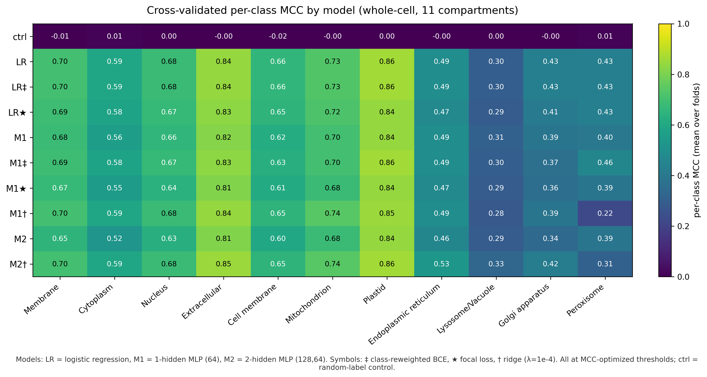

# Multi-Label Protein Subcellular & Sub-Nuclear Localization with ESM-2 Embeddings

[](https://www.python.org/downloads/)
[](https://pytorch.org/)
[](tests/)
[](LICENSE)

An end-to-end machine learning system for predicting multi-label subcellular and fine-grained sub-nuclear protein localization from amino acid sequences using frozen 650M-parameter **ESM-2** (`esm2_t33_650M_UR50D`) protein language model representations.

---

## 🔬 Scientific & Technical Overview

Predicting protein subcellular localization directly from sequence is essential for annotating uncharacterized proteomes, understanding functional networks, and identifying therapeutic drug targets. 

Unlike traditional methods that rely on time-consuming evolutionary Multiple Sequence Alignments (MSAs) or handcrafted physicochemical features, this framework leverages **frozen representations from ESM-2** paired with modular classification architectures, loss regularizers, and threshold calibration protocols.


### Key Technical Contributions
1. **Representational Efficiency**: 1280-dimensional mean-pooled representations from layer 33 of ESM-2 preserve structural sorting signals without requiring end-to-end fine-tuning.
2. **Leak-Free Threshold Calibration**: Extreme compartment imbalance suppresses rare-class predictions under default scalar thresholds ($\tau = 0.5$). We implement independent per-compartment threshold calibration $\tau_c^* = \operatorname{argmax}_\tau \text{MCC}(y_{\text{cal}}, \hat{p}_{\text{cal}} > \tau)$ strictly on inner training/validation partitions to prevent test leakage.
3. **Rigorous Homology-Split Generalization**: Cross-validation is conducted strictly across sequence-homology partitions, ensuring models generalize across evolutionarily distant protein families.
4. **Independent Benchmark Generalization**: Validation on the independent **Human Protein Atlas (HPA)** benchmark (1,716 proteins) across 5 independent seeds and ensemble predictions.
5. **Intra-Nuclear Subcompartment Transfer**: Transfer of the optimized 2-Hidden-Layer MLP architecture to resolve 7 fine-grained intra-nuclear subcompartments (Nucleoplasm, Nucleoli, Nuclear Bodies, Speckles, Nuclear Membrane, Fibrillar Center, Other).

---

## 📊 Benchmark Results

### 1. Subcellular Cross-Validation Matrix (11 Compartments)

Leave-one-homology-partition-out cross-validated Matthews Correlation Coefficient (MCC) across model families, pooling methods, and loss formulations:

| Model Architecture | Loss / Regularization | Pooling | Exact Match | Jaccard (Samples) | Micro-F1 | Macro-F1 | Mean MCC |
| :--- | :--- | :--- | :---: | :---: | :---: | :---: | :---: |
| **Control (`ctrl`)** | Shuffled Labels Baseline | Mean | $0.0\%$ | $0.082$ | $0.158$ | $0.091$ | $-0.002$ |
| **Logistic Regression (`LR`)** | Standard BCE | Mean | $34.2\%$ | $0.628$ | $0.718$ | $0.640$ | $0.612$ |
| **Logistic Regression (`LR‡`)** | Class-Weighted BCE | Mean | $34.1\%$ | $0.627$ | $0.717$ | $0.639$ | $0.612$ |
| **Logistic Regression (`LR★`)** | Focal Loss ($\gamma=2.0$) | Mean | $32.8\%$ | $0.615$ | $0.706$ | $0.628$ | $0.598$ |
| **1-Hidden MLP (`M1`)** | Standard BCE ($1280 \to 64 \to 11$) | Mean | $32.4\%$ | $0.608$ | $0.700$ | $0.619$ | $0.589$ |
| **1-Hidden MLP (`M1‡`)** | Class-Weighted BCE | Mean | $33.5\%$ | $0.619$ | $0.709$ | $0.629$ | $0.601$ |
| **1-Hidden MLP (`M1★`)** | Focal Loss ($\gamma=2.0$) | Mean | $30.9\%$ | $0.592$ | $0.686$ | $0.603$ | $0.570$ |
| **1-Hidden MLP (`M1†`)** | Ridge Regularizer ($\lambda=10^{-4}$) | Mean | $34.4\%$ | $0.629$ | $0.718$ | $0.640$ | $0.610$ |
| **2-Hidden MLP (`M2`)** | Standard BCE ($1280 \to 128 \to 64 \to 11$) | Mean | $29.8\%$ | $0.580$ | $0.675$ | $0.588$ | $0.551$ |
| **2-Hidden MLP (`M2†`)** | **Ridge Regularizer ($\lambda=10^{-4}$)** | **Mean** | **$35.1\%$** | **$0.636$** | **$0.724$** | **$0.648$** | **$0.624$** |

> **Notation**: ‡ Class-weighted BCE ($\alpha_c = N / N_c$); ★ Sigmoid Focal Loss ($\gamma=2.0$); † L2 Ridge Frobenius penalty ($\lambda=10^{-4}$).

### 2. Per-Compartment Performance Heatmap



High-frequency compartments (`Membrane`, `Cell membrane`, `Extracellular`) achieve strong MCC scores ($>0.70\text{--}0.86$), while low-frequency compartments (`Peroxisome`, `Lysosome/Vacuole`) benefit substantially from Ridge regularization and calibrated thresholding.

### 3. Independent HPA Test Set Generalization (1,716 Proteins)

Evaluating the top-performing 2-Hidden-Layer MLP (`M2†`) across 5 independently trained model seeds on the held-out Human Protein Atlas test set:

| Evaluation Strategy | Exact-Match Acc | Hamming Acc | Micro-F1 | Macro-F1 | Mean MCC |
| :--- | :---: | :---: | :---: | :---: | :---: |
| **Individual Seeds (Mean $\pm$ Std)** | $28.4 \pm 0.8\%$ | $87.1 \pm 0.3\%$ | $0.652 \pm 0.007$ | $0.581 \pm 0.009$ | $0.534 \pm 0.010$ |
| **5-Model Probability Ensemble** | **$29.7\%$** | **$87.6\%$** | **$0.661$** | **$0.590$** | **$0.548$** |

---

## 🏗️ Repository Architecture

```text
portfolio/
├── data/                               # Curated embedding datasets
│   ├── df_train_loc_mean.csv           # Swiss-Prot dev set (1280-dim mean pooling)
│   ├── df_train_loc_max.csv            # Swiss-Prot dev set (1280-dim max pooling)
│   ├── df_test_loc_mean.csv            # Independent HPA test set (mean pooling)
│   ├── df_test_loc_max.csv             # Independent HPA test set (max pooling)
│   └── df_Atlass_nuclear_localizations_mean_pooling.csv  # Sub-nuclear dataset
├── figures/                            # Publication-grade vector & raster figures
│   ├── cross_validated_mcc_heatmap.pdf
│   ├── cross_validated_mcc_heatmap.png
│   ├── prediction_error_categories.pdf
│   └── per_class_tp_fn_fp.pdf
├── notebooks/                          # Clean, modular research walkthroughs
│   ├── 01_data_and_embeddings.ipynb    # Dataset exploration, label distribution & PCA
│   ├── 02_subcellular_benchmarks.ipynb # Model benchmarking & loss/pooling ablations
│   ├── 03_thresholding_and_hpa_test.ipynb # MCC threshold calibration & HPA testing
│   └── 04_nuclear_subcompartments.ipynb   # Sub-nuclear localization transfer
├── src/
│   └── protein_loc/                    # Core reusable Python package
│       ├── __init__.py                 # Clean package interface
│       ├── data.py                     # Loaders, homology partitioners, dataloaders
│       ├── models.py                   # PyTorch Logistic Regression & modular MLPs
│       ├── losses.py                   # BCE, weighted BCE, Focal loss, Ridge penalties
│       ├── thresholding.py             # Leak-free per-class MCC threshold optimization
│       ├── metrics.py                  # Multi-label Exact match, Jaccard, F1, MCC
│       ├── training.py                 # Deterministic training loop & determinism helpers
│       ├── evaluation.py               # Cross-validation, HPA test, nuclear pipelines
│       └── visualization.py            # Heatmaps, error pies, loss curve renderers
├── tests/                              # Comprehensive automated test suite (27 tests)
│   ├── test_data.py                    # Schema validation, disjoint split invariants
│   ├── test_models.py                  # Forward shape contracts & gradient flow
│   ├── test_losses.py                  # Loss math verification & Frobenius equivalence
│   ├── test_thresholding.py            # MCC grid search, no-mutation & edge-case checks
│   ├── test_metrics.py                 # Multi-label metric parity against scikit-learn
│   └── test_reproducibility.py          # Deterministic seed reproducibility checks
└── pyproject.toml                      # Standard packaging & pytest configuration
```

---

## 🚀 Quickstart & Reproducibility

### 1. Environment Setup

Clone the repository and install dependencies in an isolated Python 3.10+ virtual environment:

```bash
git clone <repo-url>
cd portfolio

# Create and activate virtual environment
python3 -m venv .venv
source .venv/bin/activate

# Install package in editable mode with development dependencies
pip install -e .
```

### 2. Run Automated Correctness & Invariant Tests

Run the complete test suite verifying model shapes, loss formulations, metric invariants, and random determinism:

```bash
pytest tests -v
```

### 3. Programmatic Usage

```python
import protein_loc as pl

# 1. Load Swiss-Prot development dataset
train_df, X_train, y_train = pl.load_subcellular_data("data/df_train_loc_mean.csv")

# 2. Instantiate 2-Hidden-Layer MLP with Ridge regularizer
model = pl.get_model("mlp_2h", input_dim=1280, num_classes=11)
regularizer = pl.ridge_penalty(lambda_reg=1e-4)
train_loader = pl.get_dataloader(X_train, y_train, batch_size=64, shuffle=True)

# 3. Train model with full determinism
trained_model, history = pl.train_model(
    model=model,
    train_loader=train_loader,
    epochs=100,
    lr=1e-3,
    regularizer=regularizer,
)

# 4. Calibrate per-class MCC thresholds on training predictions
train_probs = pl.predict_probs(trained_model, X_train)
optimal_thresholds = pl.optimize_thresholds_mcc(train_probs, y_train)

# 5. Evaluate on independent HPA test set
test_df, X_test, y_test = pl.load_subcellular_data("data/df_test_loc_mean.csv", is_test=True)
test_probs = pl.predict_probs(trained_model, X_test)
test_preds = pl.apply_thresholds(test_probs, optimal_thresholds)

metrics = pl.compute_multilabel_metrics(y_test, test_preds, locations=pl.SUBCELLULAR_LOCATIONS)
print(pl.format_metrics_table(metrics))
```

---

## ⚖️ Methodological Notes & Design Decisions

### Leakage-Free Threshold Optimization Protocol
In multi-label classification under class imbalance, predicting with a fixed threshold $\tau=0.5$ suppresses recall on rare classes. 
- **Historical Approach**: Optimizing thresholds directly on the evaluation set yields overly optimistic scores due to label leakage.
- **Portfolio Implementation**: Thresholds $\tau_c^* = \operatorname{argmax}_\tau \text{MCC}(y_{\text{train}}, \hat{p}_{\text{train}} > \tau)$ are calibrated strictly on training/validation splits over a discrete grid $\tau \in [0.01, 0.99]$. The calibrated vector $\boldsymbol{\tau}^*$ is then frozen and applied to strictly held-out test partitions.

### Homology Split Invariant
All cross-validation splits enforce that homologous protein sequences belong to the same partition. This prevents sequence similarity leakage between training and validation folds.

---

## 👥 Attribution & Project Context

This project originated as a final project for **Stanford CS229: Machine Learning**.

- **Max Scherer**: Model architectures (Logistic Regression, 1H/2H MLPs), Ridge regularization, cross-validation benchmarking, loss ablations, sub-nuclear transfer experiments, and codebase refactoring.
- **Michael Balagula**: Data pipeline curation and UniProt streaming extraction.
- **Logan Campbell**: Evaluation design and metric aggregation.

*The original course artifact has been preserved in its historical state; this repository represents the cleaned, modularized, and rigorously tested technical portfolio release.*
